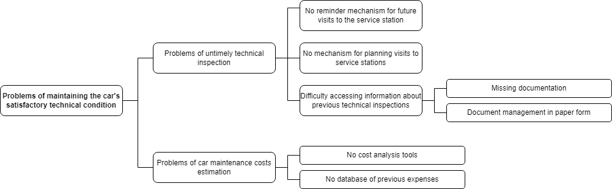
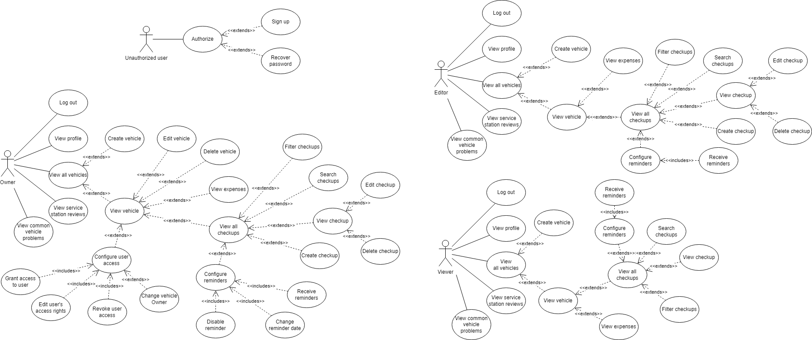

# Tell the story of your car once, CarStory will tell it a million times.
Simplify the process of monitoring your car's condition: save information about passed technical inspections, receive service reminders, view expenses, and much more!

[Take a look at CarStory here!](/promo.pdf "Promotional material")

## App history
CarStory was designed as a final assessment project titled *"Mobile application for the systematization of information about passing technical inspections by car"*.

CarStory let its author **Anna Menchykova** (formerly **Anna Bilous**) defend her bachelor's degree in specialization *"Software Engineering of Multimedia and Information Retrieval Systems"* and successfully graduate from the Faculty of Applied Mathematics at the Igor Sikorsky Kyiv Polytechnic Institute.

CarStory aims to solve these problems:

## Key features
- Add and store information about your car and its checkups.
>Stay organized! The main feature of CarStory is that it stores information about conducted services and replaced parts separately, thus breaking down expenses for each checkup in small components.
- Keep information of all your cars in one place.
>Got more than one car? No problem: CarStory lets you store information for any amount of cars.
- View your spending statistics.
>See how much you've spent for each checkup, as well as for services and parts separately. May the next checkup's cost be no surprise for you!
- Receive reminders about upcoming car inspections.
>Never forget your next inspection date again! If you don't know when to pass the next checkup, do not worry: CarStory can analyze your past checkup history and calculate the optimal reminder date itself.
- Manage access of other users to your car data.
>Want to share your checkup history with someone? Or pass car ownership to someone else? CarStory supports three types of user access to your car: Owner, Editor and Viewer. ***Don't worry: no one has any access to your data unless you explicitly allow it!***
- View car's common problems.
>Have you ever wondered what usually breaks down in other cars of your brand? CarStory generates an **anonymous** statistic of 10 most commonly conducted services and replaced parts for car of a given brand.
- View service station services' reviews.
>Want to see how well a service station conducts a specific service? CarStory generates an **anonymous** statistic of services conducted by a given service station with real reviews from CarStory users.

## Use cases

## Requirements
- Mobile device with Android version 5.0 or above
- Valid email address (for account creation)
- Stable Internet connection